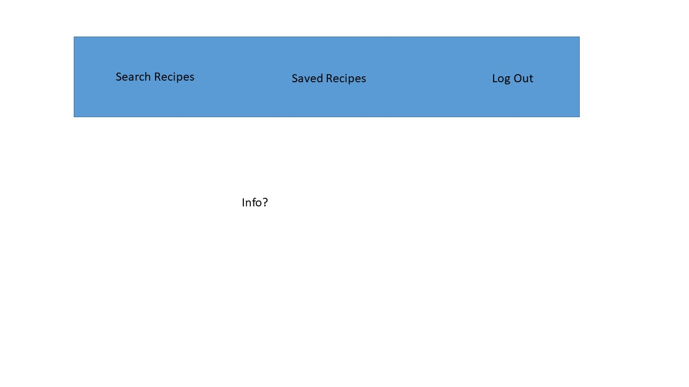
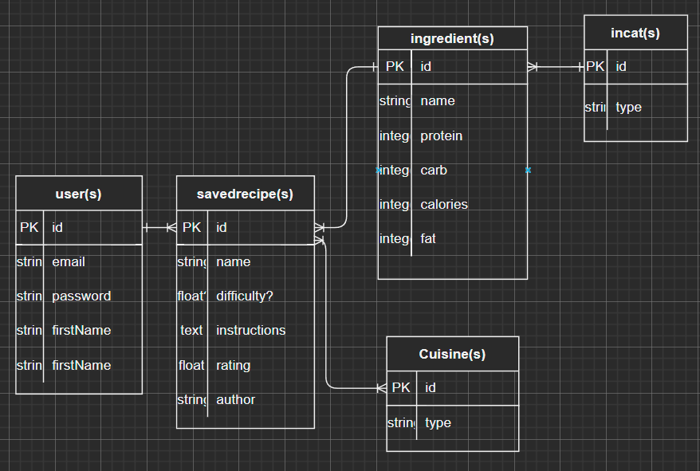

# SousChefDobbie

Introduction:
Welcome to Sous Chef Dobbie, your most (somewhat) useful cooking assistant, he can only help from the sidelines with recipe knowledge. 

Check out Sous Chef Dobbie [Here](https://souschefdobbie.herokuapp.com/)

## Post Project Reflection:
The complexity of this full stack project was greater than I had anticipated. There were a couple of things I was unable to get to due to inadequate initial planning. For example, I decided to incorporate the ability create and edit recipes but was not able to implement the creation of recipes. I also focused too much on incorporating the USDA api to obtain nutrient (calories, carbs, fat, and protein) but did not implement these features to be calculated. 

## Existing bugs:
There were multiple bugs that sprang up by the end of the project deadline, for example, I had found that the amount and UOM for ingredients were not properly linked up.

## Future Plans:
Future plans for this project would be to add create recipes and also complete the editing aspect of the recipe. I would also like to incorporate nuturient display per ingredient and aggregate for the entire recipe. Also add the ability to upload pictures of the user to be used. 

## Sources used (This is an educational full-stack learning project, I do not own copy rights or intellectual property for these images/sources)
- Images from various 
    - Harry potter Theme IP belongs to JK Rowling and associated organizations.
    - Harry Potter Image from landing page [Link](https://i2-prod.staffordshire-live.co.uk/incoming/article1931897.ece/ALTERNATES/s1200/0_HARRY-POTTER-AND-THE-HALF-BLOOD-PRINCE.jpg)
    - Hermione Granger [Link](https://i.ytimg.com/vi/SzUaInrqZQA/maxresdefault.jpg)
    - Draco Malfloy Image from landing page [Link](https://cdn.mos.cms.futurecdn.net/er4HXc7zSAUfyCkQbcpauU.jpg)
    - Nav Bar Dobby with a sock [Link](https://www.kindpng.com/picc/m/726-7266773_dobby-harrypotter-hp-hogwarts-dobby-from-harry-potter.png)
    - Cute drawn Dobby [Link](https://rlv.zcache.com/dobby_cartoon_character_art_classic_round_sticker-r29f4846ad87d4bdd989d776e74e6b450_0ugmp_8byvr_704.webp)
- USDA API [Link Here](https://www.ers.usda.gov/developer/data-apis/)
- Spoonacular API [Link Here](https://spoonacular.com/food-api)
 

## MVP Technical Requirements:
- Must have user creation feature
- Must have user sign in feature
- Must be able to search recipes
- Must be able to save searched recipes
- Must be able to view saved/seached recipes

Stretch Goals:
- Search recipes by available ingredients
- show nutritional information of individual ingredients + aggregated
- add comments feature

Technologies Anticipated:
- npm
- axios
- bcrypt
- cryptjs
- express
- ejs
- express-ejs-layouts
- method override
- css
- html
- javascript
- dotenv
- Spoonacular API
- USDA API

Challenges Anticipated:
- querying APIs and matching them
- mixing javascript and node

Wire Frames:
## Home Page

## Sign Up Page

## Log In Page

## Profile Page

## Search Recipes Page

## Saved Recipes Page

## View Recipe Page

Planned RESTful Routes:
| VERB | URL pattern | Action \(CRUD\) | Description |
| :--- | :--- | :--- | :--- |
| GET | / |\(Read\) | lists all dinosaurs |
| GET | /logout |\(Read\) | logout |
| GET | /user/login/ |\(Read\) | login landing page |
| GET | /user/login/check |\(Read\) | ROUTE - check authentication and authorize |
| GET | /signup |\(READ\) | Show Sign Up Page |
| POST | /signup/complete |\(Create\) | Create User/authentication and authorization |
| Get | /profile/ |\(Read\) | show profile page |
| PUT | /profile/edit |\(Update\) | ROUTE - make edits to profile page |
| GET | /search/recipes |\(Read\) | Search and show recipes from API |
| GET | /recipes/saved |\(Read\) | Search and show saved recipes |
| GET | /recipes/view |\(Read\) | show recipe details |

## Planned MVP User Process Map:

## Planned MVP ERD:

