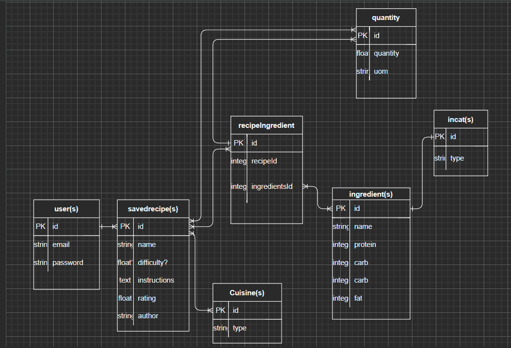

# SousChefDobbie

Introduction:
Welcome to Sous Chef Dobbie, your most (somewhat) useful cooking assistant, he can only help from the sidelines with recipe knowledge. 

MVP Technical Requirements:
- Must have user creation feature
- Must have user sign in feature
- Must be able to search recipes
- Must be able to save searched recipes
- Must be able to view saved/seached recipes

Stretch Goals:
- Search recipes by available ingredients
- show nutritional information of individual ingredients + aggregated
- add comments feature

Technologies Anticipated:
- npm
- axios
- bcrypt
- cryptjs
- express
- ejs
- express-ejs-layouts
- method override
- css
- html
- javascript
- dotenv
- Spoonacular API
- USDA API

Challenges Anticipated:
- querying APIs and matching them
- mixing javascript and node

Wire Frames:
## Home Page

## Sign Up Page

## Log In Page

## Profile Page

## Search Recipes Page

## Saved Recipes Page

## View Recipe Page

Planned RESTful Routes:
| VERB | URL pattern | Action \(CRUD\) | Description |
| :--- | :--- | :--- | :--- |
| GET | / |\(Read\) | lists all dinosaurs |
| GET | /logout |\(Read\) | logout |
| GET | /user/login/ |\(Read\) | login landing page |
| GET | /user/login/check |\(Read\) | ROUTE - check authentication and authorize |
| GET | /signup |\(READ\) | Show Sign Up Page |
| POST | /signup/complete |\(Create\) | Create User/authentication and authorization |
| Get | /profile/ |\(Read\) | show profile page |
| PUT | /profile/edit |\(Update\) | ROUTE - make edits to profile page |
| GET | /search/recipes |\(Read\) | Search and show recipes from API |
| GET | /recipes/saved |\(Read\) | Search and show saved recipes |
| GET | /recipes/view |\(Read\) | show recipe details |

## Planned User Process Map:

## Table Relations:

